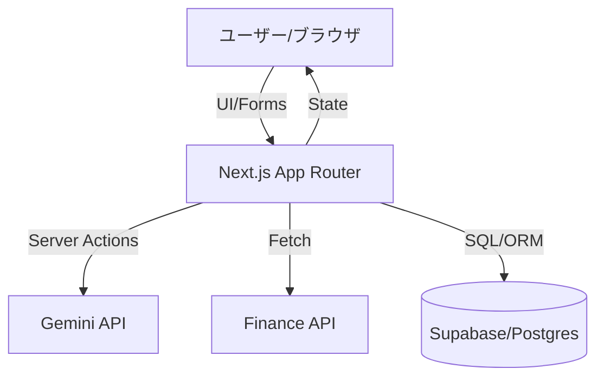

# 機能設計書 (Functional Design Document)

## システム構成図



## 技術スタック

| 分類 | 技術 | 選定理由 |
|------|------|----------|
| Framework | Next.js (App Router) | 型安全、サーバーサイド処理、最先端の Web 開発体験のため。 |
| Language | TypeScript | 開発効率と保守性の向上のため。 |
| Database | Supabase (PostgreSQL) | 高速な開発(BaaS)とリレーショナルなデータ管理が可能。 |
| UI | Tailwind CSS + shadcn/ui | 美しく、一貫性のあるデザインを迅速に構築するため。 |
| Validation | Zod | フォーム入力とAPIデータの型安全担保。 |

## データモデル定義

### Table: trades (取引履歴)

```typescript
interface Trade {
  id: string; (UUID)
  user_id: string; (FK to Auth)
  created_at: Date;
  ticker: string;
  action: 'BUY' | 'SELL' | 'HOLD';
  price: number;
  quantity: number;
  fee: number;
  pnl: number | null;
  balance_after: number;
  reason: string;
}
```

### Table: profiles (ユーザー資産)

```typescript
interface Profile {
  id: string; (UUID)
  cash_balance: number; // 初期1,000,000
  total_pnl: number;
  updated_at: Date;
}
```

## コンポーネント設計

### 1. Dashboard (Client Component)
- **資産サマリー**: 現金、時価評価額、前日比。
- **チャート**: 資産推移の可視化 (Recharts 等)。

### 2. TradeForm (Client Component)
- **銘柄検索/選択**: yfinance 対応の銘柄入力。
- **実行ボタン**: Server Action をトリガー。

### 3. GeminiAction (Server Action)
- 銘柄データ取得 -> プロンプト作成 -> Gemini 呼び出し -> 判断返却。

## ユースケースフロー

### シミュレーション実行プロセス
1. ユーザーが銘柄を選択し「AI判断を実行」をクリック。
2. Next.js Server Action が起動。
3. 外部 API から株価・指標を取得。
4. Gemini API にプロンプトを送信し売買判断を得る。
5. 判断結果に基づき、Supabase の `profiles` (残高) と `trades` (履歴) を更新。
6. `revalidatePath` により UI を最新状態に同期。

## UI設計

### ページ構成
- `/dashboard`: メイン機能（資産推移、最新履歴、実行フォーム）。
- `/history`: 過去の全取引一覧。
- `/settings`: 初期資金のリセット等。

## エラーハンドリング
- **APIエラー**: Gemini や金融データの制限時は Toast 通知。
- **バリデーション**: Zod による入力値チェック。
- **DBエラー**: トランザクション管理による整合性保持。
